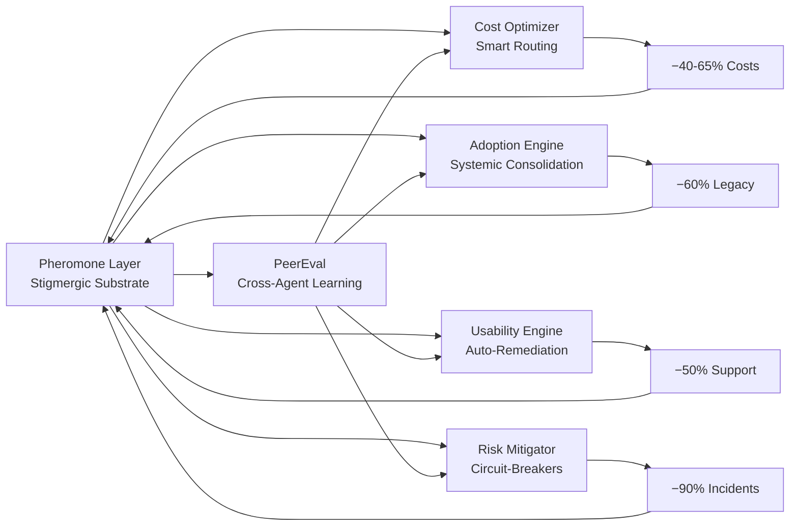

# WidgeTDC Value Flywheel — Konsolideret Arkitektur

> **"Systemet lærer eksponentielt ved at hver evaluation automatisk driver cost-optimering, adoption, usability og risikostyring — mens alle agenter deler erfaringer i realtid via pheromone-trails."**

## 5-IN-1 VALUE FLYWHEEL



## PILLAR 0: PHEROMONE SUBSTRATE (Det Manglende Lag)

Pheromoner er **indirekte agent-til-agent signaler** efterladt i miljøet (Redis + Neo4j) som andre agenter sanser og reagerer på — ligesom myrer der efterlader kemiske spor. Dette er det kommunikationssubstrat der gør flywheel'et eksponentielt i stedet for lineært.

### 5 Pheromone-Typer

**1. Attraction** — Høje PeerEval scores og succesfulde trials trækker trafik hen til effektive agenter og strategier. Styrke baseret på score; TTL 2-4 timer.

**2. Repellent** — Rate-limit storms, circuit breaker flaps, fejlede steps frastøder trafik fra overbelastede/fejlende stier. Kortere TTL (15-30 min) — fejl fader hurtigere end succeser.

**3. Trail** — Succesfulde chain-sekvenser forstærker stien for fremtidige chains. Hvis `sequential(Researcher→Analyst→Writer)` scorer 0.9 tre gange, forstærkes den sti eksponentielt via `reinforce()`.

**4. External** — Signaler fra OSINT, research feeds, competitive crawl. Outside-in intelligens der beriger den interne feedback loop. TTL 4 timer. Kilder: `run_osint_scan`, `competitive_crawl`, `research_harvest`.

**5. Amplification** — Cross-pillar compound signaler. Når PeerEval + Cost + Adoption alle peger på samme signal, skabes et multiplicativt pheromon med geometrisk middelværdi × 1.5. DER bliver flywheel'et eksponentielt.

### Lifecycle

```
DEPOSIT → SENSE → DECAY → REINFORCE/EVAPORATE → PERSIST (til Neo4j)
         ↑                          ↓
         └── AMPLIFY (cross-pillar) ┘
```

**Decay Dynamics**: Alle pheromoner mister 15% styrke per decay-cyklus (hvert 15. minut). Under 5% styrke = evaporation (sletning). Reinforced trails lever længere (TTL × 1.5 per reinforcement, max 24h). Dette forhindrer lock-in til suboptimale strategier.

### Implementation

Fil: `src/pheromone-layer.ts`
Routes: `GET /api/pheromone/status`, `GET /api/pheromone/sense`, `GET /api/pheromone/heatmap`, `POST /api/pheromone/deposit`
Cron: `pheromone-decay` — hvert 15. minut (decay + persist + amplify)

Redis keyspace: `pheromone:*` med TTL-baseret naturlig decay
Neo4j: Stærke trails (styrke > 0.7) persisteres periodisk via `memory_store`

---

## PILLAR 1: COLLECTIVE INTELLIGENCE (PeerEval)

Formål: Fleet-læring i stedet for enkelt-agent læring.

Hver agent evaluerer sig selv efter **hver eneste task** via `hookIntoExecution()`:

```
EXECUTE → SELF-ASSESS → DEPOSIT PHEROMONE → MEMORY STORE → RAG REWARD → FLEET LEARNING → BROADCAST
```

Hooks i: `chain-engine.ts` (post-step), `inventor-loop.ts` (post-trial), manual via `POST /api/peer-eval/evaluate`

**Fleet Learning Aggregation**: Exponential Moving Average (alpha=0.1) per task type. Recente evals vægter mere.

**Best Practice Broadcasting**: Når `selfScore ≥ 0.75 OG novelty ≥ 0.6`, deposites et stærkt attraction-pheromon og broadcastes til hele flåden.

**What-Works API**: `GET /api/peer-eval/fleet/:taskType` — returnerer `bestAgent`, `avgEfficiency`, `topStrategies` (fra pheromone trails), og `pheromoneStrength`.

**Fleet Analysis** (ugentlig, RLM-powered): `POST /api/peer-eval/analyze` — bruger RLM `reason` til at analysere fleet-wide patterns, identificere underperformers, og foreslå strategiske ændringer.

Fil: `src/peer-eval.ts`
Routes: `GET /api/peer-eval/status`, `GET /api/peer-eval/fleet`, `POST /api/peer-eval/analyze`

---

## PILLAR 2: SYSTEMIC ADOPTION (Consolidation-First)

Formål: Erstat i stedet for at tilføje — hold systemet sundt.

Hver task tracker hvilken feature der blev brugt. Når adoption > 80% + quality > legacy:

```
Track → Measure → Compare → Soft-Deprecate → Redirect Traffic → Archive → Delete
```

Output: `newRouteShare`, `qualityDelta`, `costDelta`, `readyForDefault`, `readyForDeprecation`

**Pheromone-integration**: Adoption signals deposites som trails. Høj adoption = stærk trail. Legacy features med faldende adoption evaporerer naturligt via decay.

---

## PILLAR 3: COST OPTIMIZATION (Dynamic Routing)

Formål: Match tasks til mest effektive agents automatisk.

Før hver task: query pheromone-laget for attraction trails i det relevante domain. Vælg agent med højest efficiency ratio (quality/cost).

```
sense(domain) → rank by strength → select best trail → route task → evaluate → deposit result pheromone
```

**Auto-Pruning**: Agenter med dalende efficiency får repellent-pheromoner der fader deres traffic naturligt. Ingen hård cut-off — smooth degradation via pheromone decay.

---

## PILLAR 4: USABILITY + RISK (Self-Healing)

Formål: Detekter og fix problemer før brugere klager.

**Anomaly Watcher** (allerede implementeret): DETECT→LEARN→REASON→ACT→REMEMBER pipeline der kører hvert 5. minut. Detekterer BÅDE negative anomalier (rate-limit storms, CB flaps) OG positive anomalier (performance spikes, edge breakthroughs).

**Pheromone-integration**: Hver anomali depositer et pheromon — repellent for negative, attraction for positive. Anomaly Watcher ER pheromone-producenten for Pillar 4.

---

## PILLAR 5: EXTERNAL INTELLIGENCE (OSINT + Research + Competitive)

**Det manglende stykke**: Systemet skal ikke kun lære af sig selv — det skal absorbere signaler fra omverdenen.

Kilder:
- `run_osint_scan` → External pheromone i `external:osint` domain
- `competitive_crawl` → External pheromone i `external:competitive` domain  
- `research_harvest` → External pheromone i `external:research` domain
- `POST /api/pheromone/deposit` → Manual external signals (API-drevet)

External pheromoner har 4-timers TTL og tagger som `external`. De blander sig med interne pheromoner i amplification-logikken — når et externt research-signal matcher en intern trail, opstår cross-pillar amplification.

---

## INVENTOR-DREVET EVOLUTION

Orchestrator Inventor bruger pheromone-laget som **fitness landscape**:

1. **Før trial**: `sense()` for at finde stærke trails i experiment-domænet → guide sampling mod vellykkede regioner
2. **Efter trial**: `onInventorTrial()` depositer attraction (score ≥ 0.7) eller repellent (score < 0.3) pheromoner
3. **PeerEval hook**: Hver trial evalueres automatisk → fleet learning opdateres → best practices broadcastes
4. **Cross-experiment**: Pheromoner fra ét experiment kan guide et andet via shared domain tags

Inventor-loopet **evolverer** pheromone-strategier over tid: trials der producerer stærke pheromoner selekteres oftere af sampleren (UCB1 + pheromone strength).

---

## FLYWHEEL COMPOUND DYNAMICS

Nøglen til eksponentiel vækst er cross-pillar amplification:

```
PeerEval scorer agent X højt på research
  → Depositer attraction pheromon
    → CostOptimizer router mere traffic til agent X
      → Mere data → bedre evals
        → Adoption engine ser ny route outperformer legacy
          → Soft-deprecate legacy
            → Simplere system → lavere costs → flere eksperimenter
              → Mere PeerEval data → stærkere pheromoner
                → AMPLIFICATION pheromon (compound signal)
                  → Forstærker HELE loopet
```

**Måling**: `GET /health` viser `pheromone_layer.activePheromones`, `peer_eval.totalEvals`, og `anomaly_watcher.totalScans` — de tre vitale tegn for flywheel-sundhed.

---

## SYSTEM HEALTH ENDPOINTS

```
GET /health                          — Platform vitals + all subsystem states
GET /api/pheromone/status            — Pheromone layer state
GET /api/pheromone/sense?domain=X    — Query pheromones
GET /api/pheromone/heatmap           — Cross-domain heatmap
POST /api/pheromone/deposit          — External signal injection
POST /api/pheromone/decay            — Manual decay cycle
GET /api/peer-eval/status            — Fleet learning state
GET /api/peer-eval/fleet             — All fleet learnings
GET /api/peer-eval/fleet/:taskType   — Task type deep dive + what-works
GET /api/peer-eval/recent            — Recent evaluations
POST /api/peer-eval/evaluate         — Manual evaluation
POST /api/peer-eval/analyze          — RLM fleet analysis
GET /api/anomaly-watcher/status      — Anomaly state
GET /api/anomaly-watcher/anomalies   — Active anomalies (filterable)
GET /api/anomaly-watcher/patterns    — Learned patterns
POST /api/anomaly-watcher/scan       — Manual scan
```

---

## CRON SCHEDULE

| Job ID | Schedule | Description |
|--------|----------|-------------|
| `anomaly-watcher` | `*/5 * * * *` | DETECT→LEARN→REASON→ACT→REMEMBER |
| `pheromone-decay` | `*/15 * * * *` | Decay + persist + cross-pillar amplify |
| `fleet-analysis` | `0 6 * * 1` | RLM fleet intelligence analysis |
| `health-pulse` | `*/5 * * * *` | Platform health probe |
| `graph-self-correct` | `0 */2 * * *` | Graph consistency |
| `failure-harvester` | `0 */4 * * *` | Red Queen pattern extraction |
| `hyperagent-autonomous-cycle` | `*/10 * * * *` | HyperAgent self-driving |

---

## TL;DR

5 pillars, 1 pheromone substrate, eksponentiel compounding:

1. **Pheromone Layer** → Stigmergisk kommunikation (myrespor i Redis)
2. **PeerEval** → Fleet learning (hver agent evaluerer, alle lærer)
3. **Adoption** → Auto-consolidation (erstat, tilføj ikke)
4. **Cost** → Smart routing (følg de stærkeste trails)
5. **Risk** → Self-healing (anomalier depositer pheromoner)

Alt integreret i én flywheel der selv-forstærker via cross-pillar amplification.
